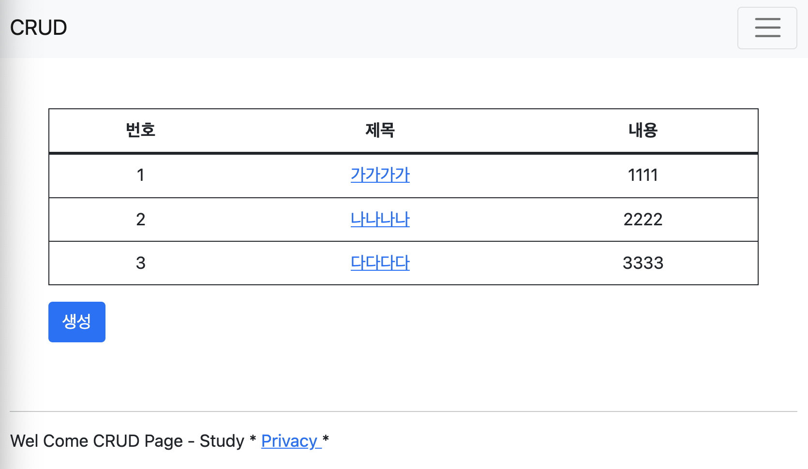
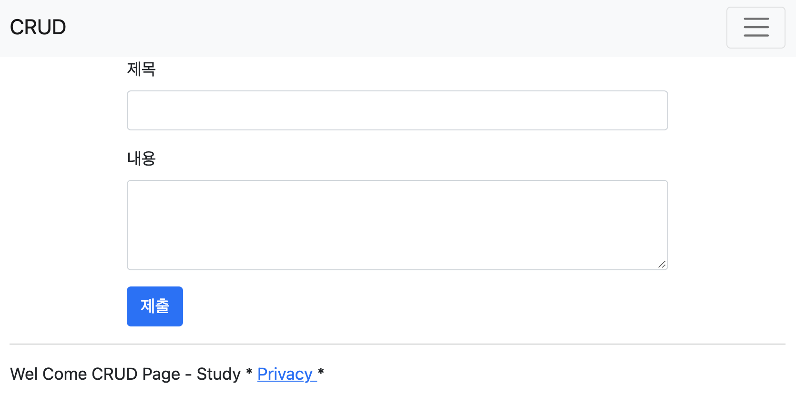
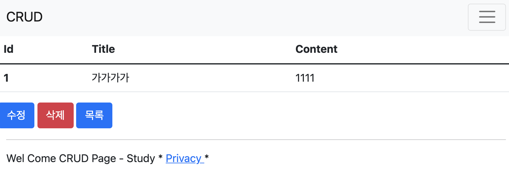
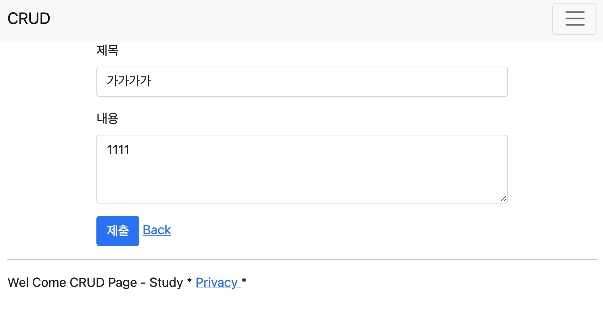
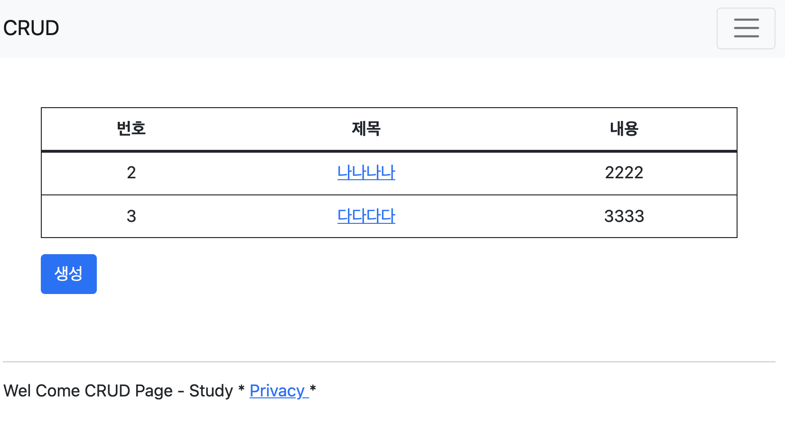

# CrudProject

<br>
<br>
# 개요

안녕하세요. 스프링을 공부한 후 스프링부트 + JPA 를 처음공부하면서 생소하지만 편리했던 부분들을 정리하고자 했고
정말 간단한 부트스트랩과 최소한의 코드를 활용한 미니멀한 CRUD 게시판을 통해 기초부터 차근차근 정리하며 쓴 글입니다.
해당 글은 먼저 블로그를 통해 적어두었습니다. <br>
https://goodthinking.tistory.com/41
<br>
<br>
<br>
<br>
## 메인화면
#### main.mustache
```html
{{>layouts/header}}
<div class="p-5">
    <table class="table table-hover text-center" style="border: 1px solid">
        <thead>
            <tr>
                <th>번호</th>
                <th>제목</th>
                <th>내용</th>
            </tr>
        </thead>
        <tbody>
            {{#articleList}}
            <tr>
                <td>{{id}}</td>
                <td><a href="articles/{{id}}">{{title}}</a></td>
                <td>{{content}}</td>
            </tr>
            {{/articleList}}
        </tbody>
    </table>
    <a class="btn btn-primary" href="write">생성</a>
</div>
{{>layouts/footer}}
```

<br>
#### Controller
```java
@GetMapping("/articles")
    public String List(Model model){

        List<Article> articleList = articleRepository.findAll();
        model.addAttribute("articleList", articleList);
        log.info(String.valueOf(articleList));
        return "main";
    }
```


## 게시글 생성
#### write.mustache
```html

<form class="container" action="/articles/create" method="post">
    <div class="mb-3">
        <label class="form-label">제목</label>
        <input type="text" class="form-control" name="title">
    </div>
    <div class="mb-3">
        <label class="form-label">내용</label>
        <textarea class="form-control" rows="3" name="content"></textarea>
    </div>

    <button type="submit" class="btn btn-primary">제출</button>
</form>
```

<br>
#### Controller
```java
 @GetMapping("/write")
    public String write(){
        return "articles/write";
    }

    @PostMapping("/articles/create")
    public String create(ArticleForm form){
        // DTO를 Entity로 변환
        Article article = form.toEntity();
        // Repository에게 Entity를 DB에 저장한다.
        Article saved = articleRepository.save(article);
        // 성공적으로 저장한다음, 다시 재요청으로 페이지를 리다이렉트로 상세페이지 호출
        return "redirect:/articles/" + saved.getId();
    }
```

## 게시글 조회
#### show.mustache
```html
<table class="table">
    <thead>
    <tr>
        <th scope="col">Id</th>
        <th scope="col">Title</th>
        <th scope="col">Content</th>
    </tr>
    </thead>
    <tbody>
        {{#article}}
        <tr>
            <th>{{id}}</th>
            <td>{{title}}</td>
            <td>{{content}}</td>
        </tr>
        {{/article}}
    </tbody>
</table>
<a href="/articles/{{id}}/edit" class="btn btn-primary">수정</a>
<a href="/articles/{{id}}/delete" class="btn btn-danger">삭제</a>
<a href="/main" class="btn btn-primary">목록</a>
```

<br>
#### Controller
```java
@GetMapping("/articles/{id}")
    public String show(@PathVariable Long id, Model model){
        log.info("id : "+ id);

        //1. id로 데이터를 가져옴
        // Optional<Article> articleEntity = articleRepository.findById(id); 자바8버전부터 제네릭코드를 이용해서 적용가능하나 일단 지양.
        Article articleEntity = articleRepository.findById(id).orElse(null); //orElse(null) = 값을 찾을 때 만약 값이 없다면 null을 반환해라라는 뜻.

        //2. 가져온 데이터를 모델에 등록
        model.addAttribute("article", articleEntity);

        //3. 보여줄 페이지를 설정
        return "articles/show";
    }
```

## 게시글 수정

<br>
#### Controller
```java
 @GetMapping("/articles/{id}/edit")
    public String edit(@PathVariable Long id, Model model){
        //PathVariable = 매핑주소에 있던 변수값을 가져온다는 뜻

        //수정 할 데이터를 가져오기
        Article articleEntity = articleRepository.findById(id).orElse(null);

        //모델 등록
        model.addAttribute("article", articleEntity);

        //뷰 페이지 설정
        return "articles/edit";
    }

    @PostMapping("/articles/update")
    public String update(ArticleForm form){
        //1. DTO를 엔티티로 변환한다.
        Article articleEntity = form.toEntity();

        //2. 엔티티를 DB로 변환한다.
        //2-1. 기존의 DB를 가져오기
        // Optional<Article> target = articleRepository.findById(articleEntity.getId()); 이렇게 해도됨
        Article target = articleRepository.findById(articleEntity.getId()).orElse(null);
        //2-2. 기존의 DB가 있다면? 값을 갱신한다. 새로저장.
        if(target != null){
            articleRepository.save(articleEntity);
        }
        log.info(articleEntity.toString());
        //3. 수정결과 페이지로 리다이렉트를 한다.
        return "redirect:/articles/" + articleEntity.getId();
    }
```
## 게시글 삭제 

<br>
#### Controller
```java
 @GetMapping("/articles/{id}/delete")
    public String delete(@PathVariable Long id, RedirectAttributes rttr){
        log.info("삭제요청이 들어왔습니다. ");

        //1. 삭제 대상을 가져온다.
        Article target = articleRepository.findById(id).orElse(null);
        log.info(target.toString());

        //2. 대상을 삭제한다.
        if(target != null){
            articleRepository.delete(target);
            rttr.addFlashAttribute("msg", "삭제가 완료되었습니다!");
        }

        //3. 결과 페이지로 리다이렉트 한다.
        return "redirect:/articles";
    }
```
